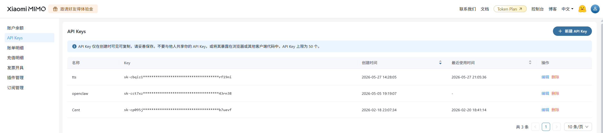
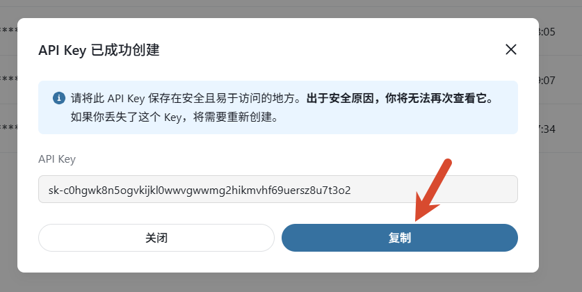
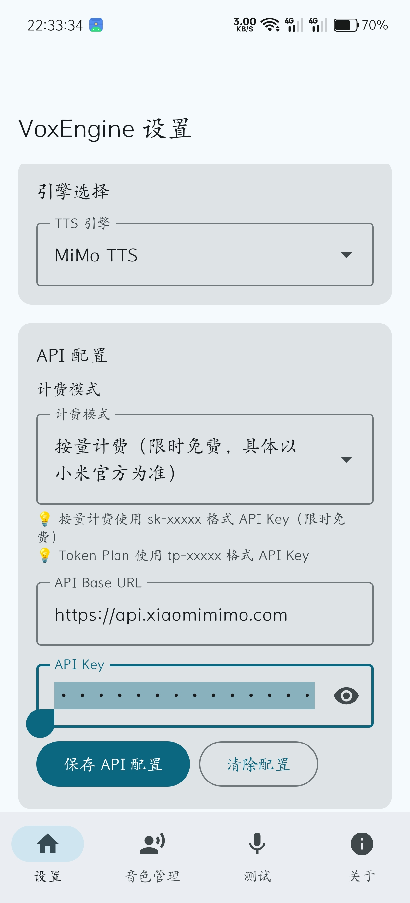
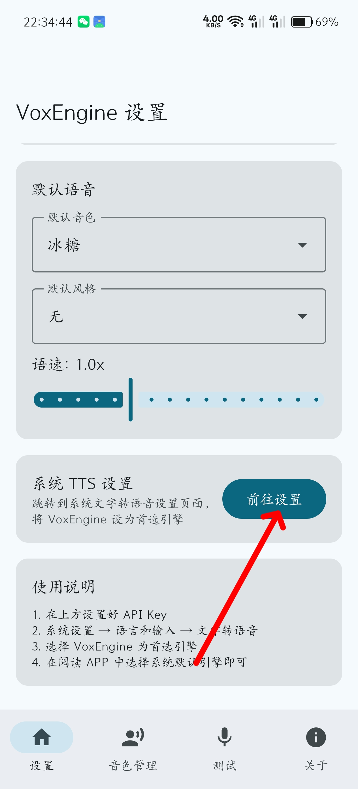
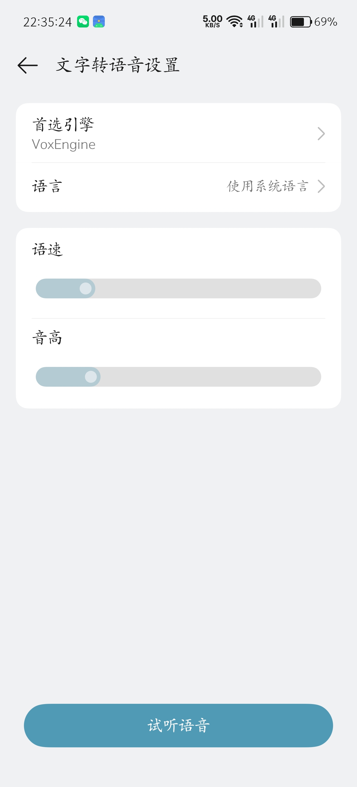
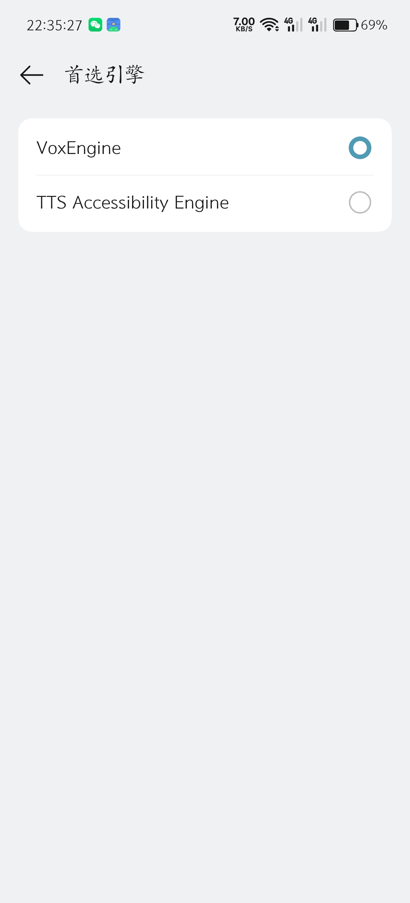

# VoxEngine

Android 系统级 TTS 语音合成引擎，支持多引擎切换、音色克隆与设计。注册为系统 TTS 服务后，任意支持系统语音合成的应用（如 Legado 阅读器）均可直接调用。

## 还需要看小说？可以试试阅读 Vox

如果你除了听书，还需要网络书源、本地阅读、AI 章节梗概、AI 改写、多角色配音和听书缓存等完整的小说阅读功能，可以使用 [阅读 Vox（Legado Vox）](https://github.com/Autsunset/legado-vox)。它是基于 Legado 与 legado-with-MD3 二次开发的独立阅读与听书应用。

- [项目主页与详细说明](https://github.com/Autsunset/legado-vox)
- [下载阅读 Vox APK](https://github.com/Autsunset/legado-vox/releases)

阅读 Vox 与 VoxEngine 是相互独立的项目，安装或使用阅读 Vox 不依赖 VoxEngine。阅读 Vox 可以直接在应用内配置 MiMo 云 TTS；如果已经安装 VoxEngine，也可以把它设为 Android 系统 TTS 后供阅读 Vox 或其他应用调用。

## 功能特性

- **可插拔引擎架构** — 统一接口设计，当前支持 MiMo TTS 与微软 Edge TTS，可继续扩展更多引擎
- **预设音色** — 内置多种中英文音色（冰糖、茉莉、苏打、白桦、Mia、Chloe 等），开箱即用
- **音色语言自动识别** — 系统 TTS 语言按当前默认音色自动上报：英文音色返回 English，日语音色返回 Japanese，其它返回中文
- **音色克隆** — 上传或录制一段音频样本，精准复刻目标音色
- **音色设计** — 通过文字描述自动生成定制音色，无需音频文件
- **风格控制** — 支持情绪、语调、方言、角色扮演等风格标签，一句话切换发音风格
- **系统 TTS 集成** — 作为 Android TextToSpeechService 运行，所有支持系统 TTS 的应用均可使用
- **内置阅读书架** — 支持导入本地 TXT 与 EPUB 小说，按章节/目录阅读并保存阅读进度
- **内置听书** — 阅读页可从当前页或选中段落开始听书，顺序合成并预缓存后续内容
- **听书稳定性优化** — 预取失败时自动补合成当前段，避免网络抖动导致跳段；音频未播完不会提前保存进度
- **克隆音色限流设置** — 克隆/设计音色的请求间隔、重试次数和重试等待可在阅读设置中调整
- **日志查询与导出** — 支持按日期、时间段、级别和关键词查询日志，复制或导出结果
- **音色导入导出** — 支持将自定义音色导出为 JSON 文件，方便备份与分享

## 图文教程

### 1. 注册 MiMo 平台

前往 [小米 MiMo TTS 平台](https://platform.xiaomimimo.com?ref=S5T7WV) 注册账号，在控制台新建 API Key。

MiMo 提供两种计费模式：

| 计费模式 | API Key 格式 | 说明 |
|---------|-------------|------|
| 按量计费 | `sk-xxxxx` | 限时免费，按调用次数计费 |
| Token Plan | `tp-xxxxx` | 需购买 Token 套餐，中国区/新加坡/欧洲节点可选 |

> 建议新手使用**按量计费**模式（当前限时免费），API Key 以 `sk-` 开头。



### 2. 复制 API Key

创建完成后复制 API Key。



### 3. 在 VoxEngine 中填入 API Key

打开 VoxEngine → 设置页面，选择计费模式，填入 API Key，点击「保存 API 配置」。然后选择你喜欢的默认音色和风格。



### 4. 进入系统 TTS 设置

在 VoxEngine 设置页点击「前往设置」，跳转到系统文字转语音设置页面。



### 5. 切换首选引擎（第一步）

在系统 TTS 设置中，点击「首选引擎」。



### 6. 选择 VoxEngine（第二步）

在引擎列表中选择 **VoxEngine**，完成！



现在任意支持系统 TTS 的应用（如阅读 Vox）都可以直接使用 VoxEngine 进行语音合成了。

> 在阅读 Vox 中使用：确保 VoxEngine 已设为系统默认引擎，打开阅读 Vox → 阅读界面 → 朗读设置 → 引擎与音色，选择对应的系统 TTS 即可。

## 内置阅读与听书

VoxEngine 也内置了简易书架，可直接导入多本本地 TXT 或 EPUB 小说。EPUB 会按照书内目录标题和 spine 正文顺序生成章节，并提取 XHTML 正文用于阅读与听书。阅读页点击屏幕中间会显示顶部/底部菜单，支持目录跳转、左右翻页、从选中段落开始听书、定时停止和播放若干章节后停止。

听书设置支持调整提前缓冲页数（1–20 页）和单次合成字数上限（180–1800 字）。合成片段按小说原始段落与角色划分，播放当前片段时持续准备后续片段，跨页、跨章与屏幕尺寸变化都不会改变已有片段。预设与 Edge 音色最多同时合成 3 个片段；克隆/设计音色仍按用户设置的间隔串行请求，避免 429 限流。

MiMo 可开启「段落上下文」。预设/克隆音色在未指定风格时，会在本地从上下文提取简短情绪提示；已指定的风格保持不变，设计音色仍沿用音色描述。前后段落原文及上下文标签不会发送给语音合成模型，朗读正文独立放在 assistant 消息中，避免上下文串读或重复。系统 TTS 也会使用调用方本次提供的文本作本地分析，后续页/章仍需要阅读应用提前请求。

「开始预缓存」可以从当前章起生成 1–100 章音频，后台通知会显示进度，并支持暂停、继续和停止。生成的音频保存到磁盘，保留 30 天、总量上限 2 GB；再次播放时直接复用。更换音色、风格、温度、上下文或分角色规则后，相应片段需重新合成。预缓存会调用语音服务；磁盘写入失败时会明确报错。

分角色设置中的「角色匹配规则」支持把别名、动作或说话习惯匹配到已配置角色。每条规则包含目标角色、正则表达式、对话前/后旁白以及启用状态，按列表顺序优先匹配，未命中则沿用内置识别。例如把 `(小张|张公子).*笑道` 匹配到「张三」。可通过 JSON 文件导入或导出角色音色与规则，便于备份分享；文件不包含 API Key 或克隆音频素材。

## 音色说明

### 预设音色（推荐）

> 预设音色开箱即用，效果最佳。预设音色同样支持自定义风格标签，可以自由搭配语调、情绪、方言等风格。

| 音色 | 描述 |
|------|------|
| 冰糖 | 甜美可爱女声 |
| 茉莉 | 温柔知性女声 |
| 苏打 | 活力阳光男声 |
| 白桦 | 沉稳磁性男声 |
| Mia | 英文女声 |
| Chloe | 英文女声 |
| Milo | 英文男声 |
| Dean | 英文男声 |

### 音色克隆

上传或录制一段参考音频（建议 3-10 秒），MiMo 会根据音频特征克隆出相似的音色。适用于复刻特定角色的声音。

> 自定义音色（克隆/设计）效果取决于输入素材和描述，可能需要多次调试才能达到理想效果。

### 音色设计

通过文字描述生成定制音色，例如：
- "温柔磁性的中年男声"
- "活泼可爱的少女音"
- "低沉沙哑的旁白声"

## 支持的风格

| 类型 | 示例 |
|------|------|
| 基础情绪 | 开心、悲伤、愤怒、恐惧、兴奋、平静、冷漠 |
| 复合情绪 | 怅然、欣慰、无奈、愧疚、释然、动情 |
| 整体语调 | 温柔、高冷、活泼、严肃、慵懒、深沉、干练 |
| 音色质感 | 磁性、醇厚、清亮、空灵、甜美、沙哑 |
| 人设腔调 | 夹子音、御姐音、正太音、大叔音、台湾腔 |
| 方言 | 粤语、四川话 |
| 角色扮演 | 孙悟空、林黛玉 |
| 唱歌 | 唱歌 |

风格可以在设置中选择默认风格。为避免提示词被 TTS 读出，应用不会再把 `(风格)` 拼接进正文文本。系统 TTS 语言会按当前默认音色自动上报，英文内容建议搭配英文音色，日语内容建议搭配 Edge 日语音色使用。

## 日志

日志页支持按日期、时间段、级别和关键词查询，查询结果可复制或导出。应用会自动脱敏音频 base64 数据，避免日志过长或泄露音频内容。

## Token Plan 节点

如果使用 Token Plan，可选择以下节点：

| 节点 | URL |
|------|-----|
| 中国区 | `https://token-plan-cn.xiaomimimo.com` |
| 新加坡 | `https://token-plan-sgp.xiaomimimo.com` |
| 欧洲 | `https://token-plan-ams.xiaomimimo.com` |

> Token Plan 可能仅限用于编程开发场景，将其接入第三方应用进行语音合成可能违反小米服务条款，导致账号被封禁。建议使用按量计费模式。

## 技术栈

- **语言**: Kotlin
- **UI**: Jetpack Compose + Material 3
- **存储**: Room + DataStore
- **网络**: OkHttp
- **音频**: Android AudioTrack
- **最低版本**: Android 8.0 (API 26)

## 构建

```bash
# Debug 版本
./gradlew assembleDebug

# Release 版本（需配置签名）
./gradlew assembleRelease
```

## 免责声明

本软件为开源项目，仅供学习和个人使用，严禁用于任何违法违规用途。使用本软件即表示您已阅读并同意 [MiMo 用户协议](https://platform.xiaomimimo.com/docs/terms/user-agreement) 和 [MiMo 隐私政策](https://privacy.mi.com/XiaomiMiMoPlatform/zh_CN/)。

## 致谢

- [MiMo TTS](https://platform.xiaomimimo.com?ref=S5T7WV) — 小米 MiMo 语音合成 API

## 许可证

本项目基于 [MIT License](LICENSE) 开源。
